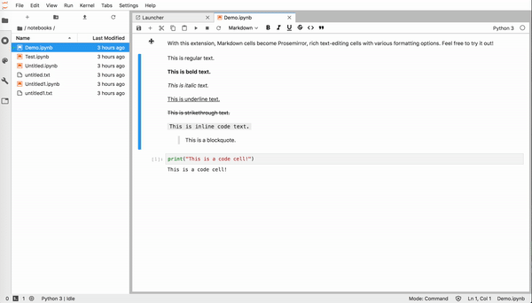

# jupyter-scribe
[](https://mybinder.org/v2/gh/jupytercalpoly/jupyterlab-richtext-mode/master?urlpath=lab/tree/notebooks/Demo.ipynb)

An extension that transforms Markdown cells into rich text-editing cells, powered by ProseMirror.



## Requirements

* JupyterLab >= 1.0.2


## Contributing

If you would like to contribute to the project, please read our [contributor documentation](https://github.com/jupyterlab/jupyterlab/blob/master/CONTRIBUTING.md).

JupyterLab follows the official [Jupyter Code of Conduct](https://jupyter.org/conduct).

### Ways you can contribute

#### Rich Text Editing

- [ ] Add table support. More info at [#43](https://github.com/jupytercalpoly/jupyterlab-richtext-mode/issues/43).
- [ ] Resolve other issues.

#### UX Improvements

- [ ] Explore per-cell UI. More info at [#44](https://github.com/jupytercalpoly/jupyterlab-richtext-mode/issues/44).

### Install

The `jlpm` command is JupyterLab's pinned version of
[yarn](https://yarnpkg.com/) that is installed with JupyterLab. You may use
`yarn` or `npm` in lieu of `jlpm` below.

```bash
# Clone the repo to your local environment
# Move to wyswiwyg-editor directory
# Install dependencies
npm install
# Build Typescript source
npm run build
# Link your development version of the extension with JupyterLab
jupyter labextension link .
# Rebuild Typescript source after making changes
jlpm build
# Rebuild JupyterLab after making any changes
jupyter lab build
```

You can watch the source directory and run JupyterLab in watch mode to watch for changes in the extension's source and automatically rebuild the extension and application.

```bash
# Watch the source directory in another terminal tab
jlpm watch
# Run jupyterlab in watch mode in one terminal tab
jupyter lab --watch
```

## Keyboard Shortcuts
Bold: Ctrl/⌘ + B
Italic: Ctrl/⌘ + I
Underline: Ctrl/⌘ + U
Strikethrough: Ctrl/⌘ + X

Normal Text Style (p): Ctrl/⌘ + Alt + 0
Title Text Style (H1): Ctrl/⌘ + Alt + 1
Subtitle Text Style (H2): Ctrl/⌘ + Alt + 2
Section 1 Text Style (H3): Ctrl/⌘ + Alt + 3
Section 2 Text Style (H4): Ctrl/⌘ + Alt + 4
Section 3 Text Style (H5): Ctrl/⌘ + Alt + 5
Caption Text Style (H6): Ctrl/⌘ + Alt + 6

Bulleted list: Ctrl/⌘ + Shift + 8
Ordered list: Ctrl/⌘ + Shift + 9
Nested list: Tab to nest a list item; Shift + Tab to unnest
Block quote:  Ctrl/⌘ + '
Inline code: Ctrl/⌘ + <
Code block: Use Markdown syntax and press enter. Example: ```python